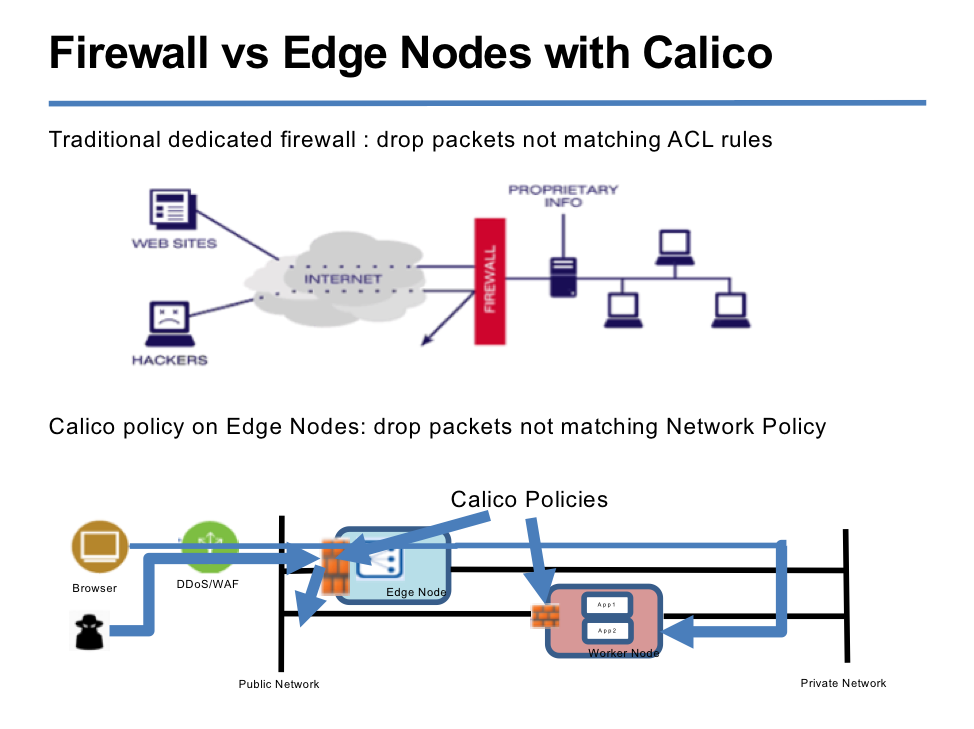

# Security + Access Control List (ACL) best practices

## Resources
- [IKS security documentation](https://console.bluemix.net/docs/containers/cs_secure.html#security)
- [IKS networking documentation](https://console.bluemix.net/docs/containers/cs_network_policy.html#default_policy)

## What IKS Provides

What IBM Cloud Kubernetes Service provides

- Dedicated and Managed Kubernetes master
  - Encrypted etcd datastore
  - Openvpn connection between master and workers
- Account access control through integrated IAM and RBAC
- Secure communication via TLS
  - When you are authenticated, IBM Cloud Kubernetes Service generates TLS certificates that encrypt the communication to and from the Kubernetes API server and etcd data store to ensure a secure end-to-end communication between the worker nodes and the Kubernetes master. 
- Worker node imaging and updates
  - Regular patches. Vetting of Kubernetes versions.
  - CIS (Center of Internet Security) Compliant image
  - Trusted Compute option
    - Select bare metal flavors
    - Hardware monitoring – verify against tampering
  - Encrypted disk
  - Set up w/AppArmor to enforce security policies: https://wiki.ubuntu.com/AppArmor
  - SSH disabled
- Default network policies
  - When you deploy, cluster is protected by Calico and Kubernetes policies.
  - Not accessible until resources are deployed to open to internet.
  - Egress open by default

## Building a Secure Environment

### Network Perimeter

- Hardware Firewall (vyatta, fortigate)
- Calico network policies

**Network Isolation**

- Control what talks to talk
- VLANs
- Edge nodes
- Kubernetes Network Policies
- Calico Network Policies
- Namespaces

**User Ingress options for network confidentiality**
1. Enforce TLS at Ingress.
2. Enforce TLS from Ingress to containers using Ingress ‘ssl-service’ annotation 
3. Enforce TLS from component to component: 
	- Self-signed CA ok within deployment or cluster across private network
	- Use Digicert/Letsencrypt for microservice to microservice over public

### Manage User Access
- RBAC
  - `kubectl get rolebinding`
  - `kubectl get clusterrolebinding`
  - `kubectl describe clusterrole admin` (ibm-operate)
- IAM
  - Adds users to IBM standardized RBAC roles/clusterroles
  - IAM Groups
- Resource Groups
  - Default only – more coming soon

### Auditing

Activity Tracker
- [Service information](https://console.bluemix.net/docs/services/cloud-activity-tracker/activity_tracker_ov.html#activity_tracker_ov)
- [Integration with IKS](https://console.bluemix.net/docs/containers/cs_at_events.html#at_events)

Examples of activity logs
- The users who made API calls to cloud services.
- The source IP address from where the API calls were made.
- The time-stamp when the API calls were made.
- The status of the API call.

### Account Structure / Environments

Options
- Cluster w/namespaces
- Multiple clusters
- Multiple PaaS accounts

### Secrets

Kubernetes object that contains a small amount of confidential information. Safer than storing in a pod specification.

Notes
- System created
  - In IBM Cloud: service binding, ingress ALB w/TLS, container registry
- User created
- Greater user control - IAM role view cannot see secrets
- base64 encoded

## What's next?

[Create a Kubernetes network policy to isolate pods in a namespace.](workshop.md)
