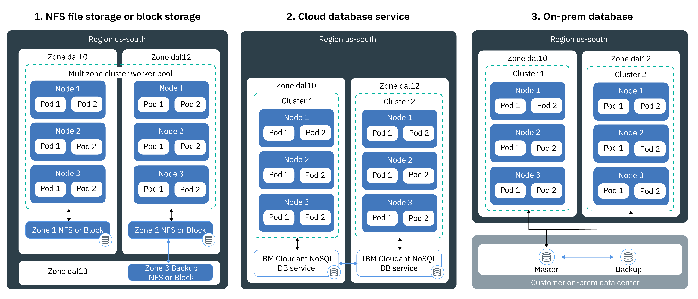

# Storing Data

Containers are ephemeral, so Kubernetes and IBM Cloud provides options for apps that require persistent storage and need to share data across pods.

## Resources
[IKS storage documentation](https://console.bluemix.net/docs/containers/cs_storage.html#storage)

## Storage options




**Persistent storage considerations**
- If you want to use Kubernetes native resources (persistent volume claims)
- If you're integrating with existing database or storage options
  - service binding
- Replication and back up needs
  - Back ups available with PVCs
  - Replication from app or use Cloud Object Storage or database
- Using a single or multi-zone cluster
- Type of read/write operations and type of apps that you're running
  - Object storage is read/write once. 1:1 between pod and storage

**Multi-zone options**
- Same, but Object and File storage do not sync across regions
    - Elasticsearch, Cassandra
    - Cloud Object Storage is recommended
- To update existing PVCs, apply labels to allow pods to deploy to correct region
- PVCs are created in round robin fashion

**Persistent volume claims**


Options
- Static
  - Existing storage from infrastructure
- Dynamic
  - Created based on specifications

Types
- File
- Block
  - ideal for statefulsets, apps that need stable unique identifiers 
- Cloud Object

Endurance options


Performance options


## Hands on!

Let's deploy a dynamically provisioned persistent volume claim to give our app access to persistent storage.

**Reminder**: Set your cluster context.
 - `ibmcloud cs cluster-config <cluster-name> --export`

### Steps

1. Create a persistent volume claim.

   `kubectl apply -f https://raw.githubusercontent.com/IBM-Cloud/kube-samples/master/iks-workshop/storage/pvc.yaml`

 Reference:
 ```
 apiVersion: v1
 kind: PersistentVolumeClaim
 metadata:
   name: mypvc
   annotations:
     volume.beta.kubernetes.io/storage-class:  "ibmc-file-bronze"
   labels:
     billingType: "hourly"
 spec:
   accessModes:
     - ReadWriteMany
   resources:
     requests:
       storage: 20Gi
 ```
 
2. View storage classes.

   `kubectl get storageclasses`

3. Determine that the pvc is provisioned.

   `kubectl get pvc`

4. Create deployment that writes a file and mounts the pvc.

   `kubectl apply -f https://raw.githubusercontent.com/IBM-Cloud/kube-samples/master/iks-workshop/storage/storage-deployment.yaml`
  
5. Create a second deployment that mounts the pvc and gets access to the file.

   `kubectl apply -f https://raw.githubusercontent.com/IBM-Cloud/kube-samples/master/iks-workshop/storage/second-deployment.yaml`

6. Get the pod name for `second-deployment`.

   `kubectl get po`

7. Exec into the pod.

   `kubectl exec -it <podname>`

8. View the file to confirm it was written and available on the pvc.

   `cd volume && ls`
 
   **Tip**: Run `df -h` to see disk usage and the id of the backing file share.
 
9. Delete the deployments.

  - `kubectl delete -f https://raw.githubusercontent.com/IBM-Cloud/kube-samples/master/iks-workshop/storage/storage-deployment.yaml`
  - `kubectl delete -f https://raw.githubusercontent.com/IBM-Cloud/kube-samples/master/iks-workshop/storage/second-deployment.yaml`

10. Delete the pvc.

   `kubectl delete pvc mypvc`
